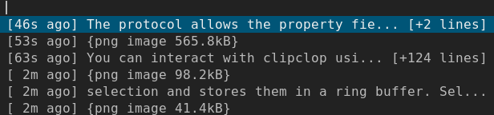

# ClipClop X clipboard manager

An X clipboard manager designed to work with dmenu.

Supports large selections and images (although dmenu will not allow you to preview them before pasting.)

Currently it does not persist the clipboard history to disk, so on restart the history will be reset. It will capture both clipboard and primary selections, and will also set both clipboard and primary selections when you choose a clip to restore.

## Status

Beta. I use it, but there's probably a few issues remaining.

## Installation

- `go build`
- Run the built `clipclop` binary as a user service / in .xinitrc / other (`cliplop -h` to see avilable flags)
- Use the provided `clip.sh` or something similar to communicate with the daemon and pipe the strings to dmenu (or equivalent).

## Usage

- run clipclop in the background
- run `clip.sh` to show your history
- choose a clip to restore to the clipboard
- paste it

## Screenshot

With dmenu:

## Similar projects

- clipmenu
- etc. https://wiki.archlinux.org/title/clipboard#Managers
